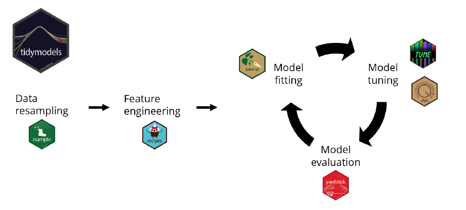
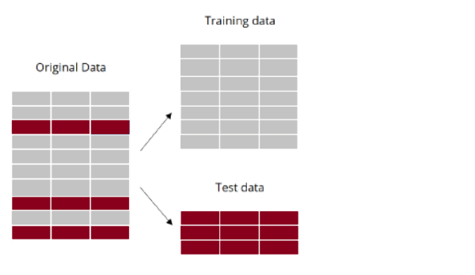
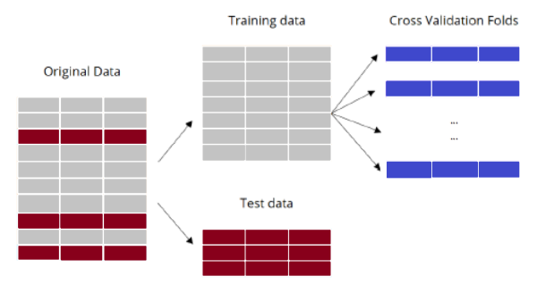

<style type="text/css"> 
body{
  background-color: #FAFAFA;
  font-size: 18px;
  line-height: 1.8;
}
code.r{
  font-size: 12pt;
}
</style>

```{r setup, include=FALSE}
# knitr::opts_chunk$set(echo = TRUE, results = 'asis', fig.show = 'asis')
knitr::opts_chunk$set(echo = TRUE, message=FALSE, warning=FALSE)
``` 

<br/>
<br/>


# Geçerleme Kümesi Yaklaşımı 

`auto` veri kümesinden hareketle aşağıdaki modeli tahmin etmek istiyoruz: 
$$mpg = \beta_0 + \beta_1 horsepower + \epsilon$$

Eğitim veri kümesini rassal olarak belirliyoruz: 
```{r, warning=FALSE}
library(ISLR)
# rassal sayı üretecinin başlangıç değeri: 
set.seed(1)
# eğitim verileri (gözlem numaraları) 
# sample() ile n=392 içinden yerine koymadan 196 sayı çekiyoruz: 
train <- sample(392, 196)
```


```{r}
# modeli sadece eğitimi verileriyle tahmin et: 
lmfit <- lm(mpg ~ horsepower,data = Auto, subset = train)
lmfit
```

Modelimizi `lmfit` nesnesine kaydettik. Şimdi sadece test verileriyle kestirimleri oluşturalım: 

```{r}
# eğitim ve test verilerini oluştur
train_auto <- Auto[train,]
test_auto <- Auto[-train,]
# eğitim verilerindeki kestirim
train_predict <- predict(lmfit, train_auto)
# Test veri setinde kestirimleri hesapla 
test_predict <- predict(lmfit, test_auto)
# Test kestirim hatasını hesapla
test_error <- test_auto$mpg - test_predict
# Ortalama hata karesi (MSE)
mean(test_error^2)
#
# sadece tek satırda yapmak istersek: 
# mean((Auto$mpg-predict(lmfit,Auto))[-train]^2)
```

Alternatif olarak karesel ve kübik modelleri düşünelim: 
$$mpg = \beta_0 + \beta_1 horsepower+ \beta_2 horsepower^2 + \epsilon$$


$$mpg = \beta_0 + \beta_1 horsepower+ \beta_2 horsepower^2 + \beta_3 horsepower^3+ \epsilon$$


Karesel model için MSE: 
```{r}
lm.fit2 <- lm(mpg~poly(horsepower,2), data = Auto, subset=train)
mean((Auto$mpg-predict(lm.fit2,Auto))[-train]^2)
```

Kübik model için MSE: 
```{r}
lm.fit3 <- lm(mpg~poly(horsepower,3), data = Auto, subset = train)
mean((Auto$mpg-predict(lm.fit3,Auto))[-train]^2)
```

Bu sonuçlara göre en düşük test kestirim hatasını veren model karesel modeldir. Acaba sonuçlar geçerleme kümesine ne kadar duyarlı? 


Yeni bir geçerleme veri kümesi oluşturup test MSE hesaplayalım: 
```{r}
set.seed(2)
train <- sample(392, 196)
lm.fit <- lm(mpg ~ horsepower, data = Auto, subset = train)
mean((Auto$mpg-predict(lm.fit,Auto))[-train]^2)
```

Karesel model: 
```{r}
lm.fit2 <- lm(mpg ~ poly(horsepower,2), data = Auto, subset = train)
mean((Auto$mpg-predict(lm.fit2,Auto))[-train]^2)
```

Kübik model: 
```{r}
lm.fit3 <- lm(mpg ~ poly(horsepower,3), data = Auto, subset = train)
mean((Auto$mpg-predict(lm.fit3,Auto))[-train]^2)
```

Geçerleme yaklaşımı ile elde edilen test MSE değeri yüksek değişkenliğe sahiptir. Bunu görmek için Auto verilerini kullanarak çok sayıda tekrarlayalım: 
```{r message=FALSE, warning=FALSE}
# replicate the validation set approach many times using Auto data 
library(tidyverse)
library(ISLR2)

dmax = 10 # max degree of the polynomial, the flexibility
nrep = 20 # number of replications
#
set.seed(1)
# create an empty tibble
mse <- tibble(rep = numeric(), d = numeric(), testmse = numeric())

for (i in 1:nrep){
  train <- sample(392,196)   # train-test splits
  train_auto <- Auto[train,] # train data 
  test_auto <- Auto[-train,] # test data 
  # loop over flexibility
  for (j in 1:dmax){
    lmfit <- lm(mpg ~ poly(horsepower,j), data = train_auto)
    test_predict <- predict(lmfit, test_auto)
    test_error <- test_auto$mpg - test_predict
    MSE = mean(test_error^2)
    mse <- add_row(mse, rep=i, d=j, testmse = MSE ) 
  }
}

mse |> 
  ggplot(aes(d,testmse,color=factor(rep))) + 
  geom_line() +
  geom_point() +
  scale_x_continuous(breaks=c(1:dmax)) +
  labs(x="Degree of the polynomial", 
       y="Test MSE") +
  theme(legend.position="none")
```


Bu grafikten görüleceği gibi, geçerleme kümesi yaklaşımı ile elde edilen test MSE tahminleri yüksek varyansa sahiptir. Alternatif olarak çapraz geçerleme yaklaşımları kullanılabilir.  


# Biri-Hariç Çapraz Geçerleme (LOOCV)

Biri-hariç çapraz geçerlemede (LOOCV - Leave-one-out Cross Validation) modeli bir gözlemi dışarıda bırakarak tahmin ediyoruz. Dışarıda bırakılan gözlemi kestirim yapmak ve test hatasını tahmin etmek için kullanıyoruz. 

Örneğin Auto veri kümesini kullanarak mpg için bir lineer regresyon modeli kuralım ve LOOCV yöntemiyle test hatasını (MSE) tahmin edelim: 
```{r}
data(Auto)
n = nrow(Auto)
loocv = numeric(n) # test MSE için sıfır vektörü oluştur, döngü içinde dolduracağız
for (i in 1:n){
  testdata <- Auto[i,]
  traindata <- Auto[-i,]
  lmfit <- lm(mpg ~ poly(horsepower,1), # degree = 1
              data = traindata)
    test_predict <- predict(lmfit, testdata)
    test_error <- testdata$mpg - test_predict
    loocv[i] <- mean(test_error^2)
}
MSE_LOOCV_degree1 <- mean(loocv)
MSE_LOOCV_degree1
```

Polinom derecesi d=1 (yani mpg'nin horsepower üzerine doğrusal regresyonu) için LOOCV MSE değeri 24.23151 olarak tahmin edildi. 

Karesel model, d=2: 
```{r}
data(Auto)
n = nrow(Auto)
loocv = numeric(n) #  
for (i in 1:n){
  testdata <- Auto[i,]
  traindata <- Auto[-i,]
  lmfit <- lm(mpg ~ poly(horsepower,2),  # degree 2
              data = traindata)
    test_predict <- predict(lmfit, testdata)
    test_error <- testdata$mpg - test_predict
    loocv[i] <- mean(test_error^2)
}
MSE_LOOCV_degree2 <- mean(loocv)
MSE_LOOCV_degree2
```

Polinom derecesi için bir döngü içinde LOOCV MSE hesaplamaları: 
```{r}
data(Auto)
n = nrow(Auto)
loocv = numeric(n) #  
dmax = 10
MSE_LOOCV = numeric(dmax)
for (d in 1:dmax){
for (i in 1:n){
  testdata <- Auto[i,]
  traindata <- Auto[-i,]
  lmfit <- lm(mpg ~ poly(horsepower,d),  # degree d
              data = traindata)
    test_predict <- predict(lmfit, testdata)
    test_error <- testdata$mpg - test_predict
    loocv[i] <- mean(test_error^2)
}
MSE_LOOCV[d] <- mean(loocv) 
}
MSE_LOOCV
```

Grafiğini çiz: 
```{r}
tibble(MSE_LOOCV) |> 
  ggplot(aes(1:10,MSE_LOOCV)) + 
  geom_line() +
  geom_point() + 
  scale_x_continuous(breaks=c(1:dmax)) +
  labs(x="Degree of the polynomial", 
       y="Test MSE", 
       title="LOOCV test error") 
  
```


Çapraz geçerleme için `boot` paketindeki `cv.glm()` fonksiyonunu `glm()` ile birlikte kullanabiliriz. 

`glm()` fonksiyonu `lm()`'e benzer:  
```{r}
# modeli glm ile tahmin et: 
glm.fit <- glm(mpg ~ horsepower, data = Auto)
coef(glm.fit)
# lm ile tahmin: 
lm.fit <- lm(mpg ~ horsepower, data = Auto)
coef(lm.fit)
```

`cv.glm()` fonksiyonunun kullanımı:
```{r}
library(boot)
glm.fit <- glm(mpg ~ horsepower, data = Auto)
cv.err <- cv.glm(Auto, glm.fit)
cv.err$delta
```

`cv.err$delta` çapraz geçerleme ortalama hatasını vermektedir (ilk değer denklem (5.1), ikinci değer ise düzeltilmiş kestirim hatasıdır, burada LOOCV kullanıldığı için her iki değer birbirine çok yakındır). `cv.glm()` default olarak LOOCV uygular. K-katlı çapraz geçerleme için de kullanılabilir. 


LOOCV yaklaşımını biraz daha karmaşık modellere uygulayalım ve sonuçları karşılaştıralım. Beşinci dereceye kadar polinom modeller tahmin edeceğiz. Bunu bir döngü içinde yapmak daha pratiktir: 
```{r}
# 5 elemanlı sıfır vektörü; döngü içinde güncellenecek
cv.error <- rep(0,5)
#
for (i in 1:5){
  glm.fit <- glm(mpg ~ poly(horsepower,i), data = Auto)
  cv.error[i] <- cv.glm(Auto, glm.fit)$delta[1]
}
cv.error
```

```{r}
plot(cv.error, type = "b")
```


# $k$-katlı Çapraz Geçerleme

$k$-katlı Çapraz Geçerlemede eğitim verileri kendi içinde $k$ gruba ayrılır. Her bir grup sırasıyla geçerleme kümesi görevi görür. Gruplardan biri geçerleme (test) işlevi için kullanılırken diğer $k-1$ grup modelin eğitiminde kullanılır. 

Örnek: Auto veri seti ile mpg kestirimi, lineer model (d=1), k=5 katlı çapraz geçerleme
```{r}
data(Auto)
n = nrow(Auto)
k = 5
kfoldcv = numeric(k) #  
# create a loop over k
set.seed(17)
folds <- sample(1:k, n, replace=TRUE)
for (i in 1:k){
  testdata <- Auto[folds == i,]
  traindata <- Auto[folds != i,]
  lmfit <- lm(mpg ~ poly(horsepower,1), # degree = 1
              data = traindata)
    test_predict <- predict(lmfit, testdata)
    test_error <- testdata$mpg - test_predict
    kfoldcv[i] <- mean(test_error^2)
}
kfoldcv
MSE_kfoldcv_degree1 <- mean(kfoldcv)
MSE_kfoldcv_degree1
```
$k=5$ katlı çapraz geçerleme kullanarak tahmin ettiğimiz test MSE değeri 23.87 oldu. 

Tipik olarak uygulamada çapraz geçerlemenin kullanım amaçlarından biri modelin/algoritmanın karmaşıklık/esneklik düzeyinin belirlenmesidir. Burada amaç aşırı uyumdan kaçınmak ve optimal esneklik düzeyini belirlemektir. Örneğin mpg tahmininde kullandığımız polinom modellerin derecesi karmaşıklık düzeyini belirler (d arttıkça modelin esnekliği/karmaşıklığı artmaktadır). 

Çarpraz geçerleme ile modelin karmaşıklığını belirlemek istersek her bir parametre değeri için (örneğin polinom derecesi) test MSE değerlerini hesaplamamız gerekir. Yani yukarıdaki hesaplamaları d için bir döngü kurarak tekrar yapabiliriz. 

Alternatif olarak pratikte `boot::cv.glm()` fonksiyonunu kullanabiliriz. Örneğin, $k=10$ için doğrusal modelde çapraz geçerleme test hatası: 
```{r}
set.seed(12345)
glm.fit <- glm(mpg ~ horsepower, data = Auto)
cv_lin_error_10 <- cv.glm(Auto, glm.fit, K=10)$delta[1]
cv_lin_error_10
```

5. dereceye kadar polinom modeller için 10-katlı çapraz geçerleme test hata tahminleri: 
```{r}
# ISLR aynı sonuçlar için seed değeri: 
set.seed(234)
cv.error.10 <- rep(0,5)
for (i in 1:5){
  glm.fit <- glm(mpg ~ poly(horsepower,i), data = Auto)
  cv.error.10[i] <- cv.glm(Auto, glm.fit, K=10)$delta[1]
}
cv.error.10
```

```{r}
plot(cv.error.10, type = "b")
```

# Bootstrap 

Bootstrap tekniğinin uygulanması oldukça basittir. Bunun için ilgilendiğimiz istatistik ya da tahminciyi hesaplayan bir fonksiyona ve elimizdeki verilerden *yerine koymalı örnekleme* yapabilen ayrı bir fonksiyona ihtiyacımız vardır.  

Örnek olarak yöntemi öneren Efron, B. ve R. Tibshrani'nin orijinal makalelerinde kullandıkları verileri ele alalım (bkz. "Bootstrap Methods for Standard Errors, Confidence Intervals and Other measures of Statisical Accuracy." Statistical Science, 1(1986): 54-77).

Bu veri setinde ABD'deki 15 hukuk fakültesinin 1973 yılı ortalama LSAT puanları ile GPA değerleri yer almaktadır:  
```{r}
LSAT <- c(576, 635, 558, 578, 666, 580, 555, 661, 651, 605, 653, 575, 545, 572, 594)
GPA <- c(3.39, 3.30, 2.81, 3.03, 3.44, 3.07, 3.00, 3.43, 3.36, 3.13, 
        3.12, 2.74, 2.76, 2.88, 2.96)
data <- data.frame(LSAT,GPA)
plot(LSAT,GPA)
```

Amacımız korelasyon katsayısının standart hatasını "bootstrap" tekniği ile tahmin etmek. Örneklem korelasyon katsayısı:
```{r}
cor(LSAT, GPA)
```

Bootstrap standart hatasını bulmak için verilerden rassal olarak ve yerine koyarak $n$ boyutlu örneklemler çekip her örneklem için korelasyon katsayısını hesaplayacağız ve kaydedeceğiz. Amacımız korelasyon katsayısının örnekleme dağılımını tahmin etmektir. Bu amaçla  `sample(n, n, replace=TRUE)` komutunu $B=1000$ yinelemeli olarak kullanabiliriz: 
```{r}
set.seed(111)
B <- 1000 
bootsample <- rep(0,B)
for (i in 1:B){
  index <- sample(15,15,replace = TRUE)
  bootsample[i] <- cor(LSAT[index], GPA[index])
}
hist(bootsample)
```

```{r}
sqrt(var(bootsample))
summary(bootsample)
```

Bootstrap standart hatası 0.1275 olarak tahmin edilmiştir (yukarıda referansını verdiğimiz makaledeki sonuçla pratik olarak aynıdır). Bootstrap ortalamasının, 0.7803, örneklem korelasyon katsayısı, 0.776, ile örtüştüğüne dikkat ediniz. 


`R` `boot()` fonksiyonu yukarıdaki hesaplamayı otomatikleştirir. Ancak bunun için öncelikle bir fonksiyon yazmalıyız. Aşağıdaki örnekte `corboot()` fonksiyonu örneklem korelasyon katsayısını, gözlem numaralarını içeren `index` kümesini kullanarak hesaplar ve çıktı olarak verir. Daha fazla detay için `boot()` yardım dosyasına bakılabilir.
```{r}
# örneklem istatistiğini hesaplayan jenerik fonksiyon
corboot <- function(data, index){
  X <- data[index,1]
  Y <- data[index,2]
  return(cor(X,Y))
}
# boot fonksiyonunun kullanımı
library(boot)
set.seed(111)
boot(data = data, statistic = corboot, R=1000)
```

Bootstrap standart hatası 0.131 olarak tahmin edilmiştir. 

## Regresyon Modelinde Bootstrap Standart Hataları

Bootstrap tekniği bir makine öğrenmesi yönteminin katsayı tahminlerindeki değişkenliğin ölçülmesinde kullanılabilir. Örneğin doğrusal regresyon modelinde katsayı tahminlerinin standart hataları bootstrap yaklaşımı ile hesaplanabilir. Kesit veri setinin ilgili anakütleden bağımsız ve türdeş (iid) örnekleme ile çekildiği varsayımını yapıyoruz. Bu yaklaşım ölçümler arasında bağımlılığın olduğu zaman serilerine burada ele aldığımız yalın haliyle uygulanamaz. Zaman serileri için geliştirilmiş daha karmaşık bootstrap yöntemleri vardır (burada değinmeyeceğiz). 

Sıradan en küçük kareler (OLS) tahmincilerinin standart hata formülleri incelenirse bu formüllerin bazı varsayımlar altında geçerli olduğu kolayca görülebilir. Bunlardan en önemlisi hata teriminin varyansının, $\sigma^2$, sabit olmasıdır. Değişen varyans (heteroskedasticity) durumunda veya modelde dikkate alınmamış doğrusal olmayan ilişkiler varsa bu standart hata formülleri geçerli olmaz. Bootstrap yöntemi ise bu varsayımlara dayanmaz. Yani değişen varyans altında da geçerlidir.  

Bootstrap standart hatalarını hesaplamak için önce `boot.fn()` isimli bir fonksiyon yazalım. Bu fonksiyon iki girdiye sahiptir, `data` ve `index`. İkinci girdi gözlemlerin numaralarını içermektedir. Böylece farklı bootstrap örneklemleri için OLS tahmini yinelenebilir. Kolaylık amacıyla sadece `mpg` modeli için geçerli olacak şekilde yazılmıştır:  
```{r}
boot.fn <- function(data, index)
  return(coef(lm(mpg ~ horsepower, data = data, subset = index)))
# örnek: tüm gözlemleri kullan
boot.fn(Auto,1:392)
```

Yerine koymalı bootstrap örnekleri: 
```{r}
set.seed(1)
# 1. bootstrap 
boot.fn(Auto, sample(392, 392, replace=T))
# 2. bootstrap
boot.fn(Auto, sample(392, 392, replace=T))
```

Şimdi `boot()` fonksiyonunu çağırabiliriz:
```{r}
boot(Auto, boot.fn, 1000) 
```

1000 tekrar sonucu tahmin edilen katsayı standart hataları sabit için 0.845, eğim katsayısı için 0.0073'dür. OLS ile kıyaslayalım:  
```{r} 
summary(lm(mpg ~ horsepower, data=Auto))$coef
```

OLS standart hataları daha düşüktür. Ancak doğrusal modelin iyi bir uyum sergilemediği düşünülürse bootstrap standart hatalarının daha sapmasız bir standart hata tahmini verdiğini söyleyebiliriz. 

`mpg` için karesel model daha başarılı bir uyum göstermişti. Bu model için bootstrap standart hataları hesaplayalım: 
```{r}
boot.fn2 <- function(data, index)
  coefficients(lm(mpg ~ horsepower + I(horsepower^2), data = data, subset=index))
set.seed(1)
boot(Auto, boot.fn2, 1000)
```

OLS sonuçları ile kıyaslayınız: 
```{r}
summary(lm(mpg~horsepower+I(horsepower^2),data=Auto))$coef
```


# Tidymodels Paketi


[Tidymodels](https://www.tidymodels.org/) makine öğrenmesi modellemesi için tasarlanmış bir `R` paketler topluluğudur. Tidymodels Tidyverse prensiplerini kullanır ve bu paketler ile uyumlu çalışır. Tidymodels içindeki paketler şunlardır: 

- `rsample`: verilerin yeniden örneklenmesi  

- `recipes`: önemli özelliklerin/değişkenlerin belirlenmesi (feature engineering) 

- `parsnip`: modelin tahmini/eğitimi 

- `tune`, `dials`: modelin ayarlanma parametrelerinin seçimi (örneğin polinom derecesi)

- `yardstick`: modelin performansının değerlendirilmesi

 

Tidymodels paketine giriş ve başlangıç için bkz: [https://www.tidymodels.org/start/](https://www.tidymodels.org/start/)


```{r}
# first install tidymodels 
# needs to be done once
# install.packages("tidymodels")
```

Örnek: Tidymodels ile `Auto` veri kümesindeki mpg için bir polinom regresyon modeli kuralım. 

İlk adım veri kümesinin eğitim ve test olarak ayrılmasıdır. Burada elimizde ayrıca bir test kümesinin olmadığını varsayıyoruz (örneğin kaggle.com'daki yarışmalarda test verileri ayrıca verilir). Eğitim-test ayrımını yaptıktan sonra modelin ayarlanma parametresini (yani polinom derecesini) sadece eğitim kümesini kullanarak bulmamız gerekir. Bunun için eğitim verilerine çapraz geçerleme uygulayabiliriz. 

Eğitim-test ayrımını yapmak için `{rsample}` paketinde yer alan `initial_split()` fonksiyonunu kullanabiliriz. Önceki kısımlarda olduğu gibi `mpg`'yi `horsepower` ile tahmin etmeye çalışacağız. Verileri %75'ini eğitim kalan %25'ini test için ayıracağız. 

```{r message=FALSE, warning=FALSE}
library(tidymodels)
library(ISLR)
set.seed(1)
auto_split <- initial_split(Auto, 
                           prop = 0.75, 
                           strata = mpg)
```

Yukarıdak kod parçasındaki `strata` girdisi eğitim ve test verilerinin mpg'nin dağılımı açısından birbirine benzemesini garanti eder.  

Eğitim verilerini görmek istersek: 
```{r}
auto_train <- auto_split |> training()
head(auto_train)
```

Test verileri: 
```{r}
auto_test <- auto_split |> testing()
head(auto_test)
```

Test verisi, `auto_test`, sadece bir kez seçilen modelin başarısının değerlendirilmesinde kullanılacaktır.  

```{r}
auto_train |> 
  ggplot(aes(mpg)) + 
  geom_boxplot() +
  labs(title="Eğitim verisi")
auto_test |> 
  ggplot(aes(mpg)) + 
  geom_boxplot() +
  labs(title="Test verisi")
```


Şimdi ilk modelimizi kuralım, `mpg`'nin `horsepower` üzerine regresyonunu tahmin edelim. Bunun için `{parsnip}` paketini kullanacağız ve aşağıdaki adımları takip edeceğiz: 

1. Model türünü belirle. Bu örnekte `parsnip::linear_reg()`. Diğer modeller için bkz. [https://www.tidymodels.org/find/parsnip/](https://www.tidymodels.org/find/parsnip/)

2. Modeli eğitmekte kullanılacak fonksiyonu belirle. Örneğimizde `lm()` fonksiyonunu kullanacağız: `parsnip::set_engine('lm')`. 

3. Gözetimli öğrenme türünü belirle (regression ya da classification), `parsnip::set_mode('regression')`. 

Bu bilgileri kullanarak model nesnesi yaratalım: `lm_model`
```{r}
lm_model <- linear_reg() |> 
  set_engine('lm') |> 
  set_mode('regression')
```

```{r}
lm_model
```

Modeli eğitmeye hazırız. Bunun için `parsnip::fit()` fonksiyonu kullanılabilir: 

```{r}
auto_fit <- lm_model |> 
  fit(mpg ~ horsepower, data = auto_train)
```


Sonuçları özetlemek için `broom::tidy()` ile tablo oluşturalım:  
```{r}
tidy(auto_fit)
```

Modelimiz eğittiğimize göre artık yeni verilerde (test ya da geçerleme verileri) kestirimleri ve hatayı hesaplayabiliriz: 
```{r}
auto_preds <- auto_fit |> 
  predict(new_data = auto_test)
```

`auto_preds` nesnesinin içeriğine bakalım: 
```{r}
head(auto_preds)
```

Bu nesne `.pred` isimli tek bir sütundan oluşmaktadır.  

Modelin performansını nasıl ölçebiliriz? Bunun için gerçek `mpg` ve `horsepower` değerlerini ve kestirimleri içeren bir veri kümesi oluşturalım:  

```{r}
auto_test_results <- auto_test |> 
  select(mpg, horsepower) |> 
  bind_cols(auto_preds)
```

Yeni veri kümesinin içeriği: 
```{r}
head(auto_test_results)
```

Tidymodels paketlerinden `{yardstick}` ile model değerlendirme ölçütlerini hesaplayabiliriz. Örneğin `rmse()` ortalama hata karesinin (MSE) kareköküdür: 
```{r}
auto_test_results |> 
  rmse(truth = mpg, estimate = .pred)
```

`rmse()` iki girdiye ihtiyaç duyar, gerçek ve kestirilen değerler. 

Başka bir başarı ölçütü gerçek ile tahmin arasındaki R-kare değeridir: 
```{r}
auto_test_results |> 
  rsq(truth = mpg, estimate = .pred)  
```
Yüksek R-squared değerleri daha başarılı modellere işaret eder. 

Tahmin ve gerçek değerlerin grafiğini de çizebiliriz: 
```{r}
ggplot(auto_test_results, aes(x = mpg, y = .pred)) +
  geom_point() +
  geom_abline(color = 'blue', linetype = 2) +
  coord_obs_pred() +
  labs(title = 'R-Squared Plot',
       y = 'Predicted MPG',
       x = 'Actual MPG')
```


Başarılı bir kestirim için tahmin (y ekseni) değerlerinin 45 derece doğrusu üzerinde dağılmasını bekleriz. Yukarıdaki örnekte ise lineer modelin çok başarılı olmadığını görüyoruz.  

Şimdi karesel modeli tahmin edelim ve performansını değerlendirelim. Yine lineer regresyon yapısını kullanacağımız için `lm_model` nesnesini değiştirmemiz gerekmiyor. Ancak `fit()` formülümüz değişti:  

```{r}
auto_fit2 <- lm_model |> 
  fit(mpg ~ horsepower + I(horsepower^2), data = auto_train)
```


Tahmin sonuçları: 
```{r}
tidy(auto_fit2)
```


Test verisi ile kestirimlerin hesaplanması:  
```{r}
auto_preds2 <- auto_fit2 |> 
  predict(new_data = auto_test)
```

`auto_preds` nesnesinin içeriği: 
```{r}
auto_preds2
```

```{r}
auto_test_results2 <- auto_test |> 
  select(mpg, horsepower) |> 
  bind_cols(auto_preds2)
```

İçeriği: 
```{r}
head(auto_test_results2)
```

`{yardstick}` paketiyle `rmse()` hesapları: 
```{r}
auto_test_results2 |> 
  rmse(truth = mpg, estimate = .pred)
```
Doğrusal modele göre karesel modelin daha başarılı olduğunu görüyoruz. 

```{r}
# R-kare 
auto_test_results2 |> 
  rsq(truth = mpg, estimate = .pred)  
```
 
```{r}
ggplot(auto_test_results2, aes(x = mpg, y = .pred)) +
  geom_point() +
  geom_abline(color = 'blue', linetype = 2) +
  coord_obs_pred() +
  labs(title = 'R-Squared Plot',
       y = 'Predicted MPG',
       x = 'Actual MPG')
```

R-kare ölçütüne göre de tahminlerin daha başarılı olduğu görülüyor.  

`{tune}` paketinde yer alan `last_fit()` fonksiyonunu kullanarak kestirimleri ve performans ölçütlerini hesaplayabiliriz: 

```{r}
lm_last_fit <- lm_model |> 
  last_fit(mpg ~ horsepower + I(horsepower^2), 
           split = auto_split)
```

`tune::collect_metrics()` fonksiyonu: 
```{r}
lm_last_fit |> 
  collect_metrics()
```

`tune::collect_predictions()` fonksiyonu:  
```{r}
lm_last_fit |> 
  collect_predictions()
```


Tidymodels ile k-katlı çapraz geçerleme: 

 




İlk adım katların (grupların) oluşturulmasıdır. Bu amaçla `vfold_cv()` kullanılabilir. Örneğin k=5 için: 
```{r}
set.seed(12)
folds <- vfold_cv(auto_train, v = 5)
folds
```

Her kat için modeli eğitmek amacıyla bir workflow oluşturalım: 
```{r}
auto_wf <- workflow() |> 
  add_model(lm_model) |>  
  add_formula(mpg ~ horsepower + I(horsepower^2))
auto_wf
```

```{r}
auto_fit_rs <- auto_wf |> 
  fit_resamples(folds)
auto_fit_rs
```
RMSE ve rsq ölçütleri: 
```{r}
collect_metrics(auto_fit_rs)
```


<br>
<div class="tocify-extend-page" data-unique="tocify-extend-page" style="height: 0;"></div>

