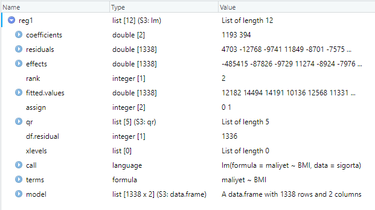

<style type="text/css"> 
body{
  background-color: #FAFAFA;
  font-size: 18px;
  line-height: 1.8;
}
code.r{
  font-size: 12pt;
}
</style>

```{r setup, include=FALSE}
# knitr::opts_chunk$set(echo = TRUE, results = 'asis', fig.show = 'asis')
knitr::opts_chunk$set(echo = TRUE, message=FALSE, warning=FALSE)
Sys.setlocale("LC_ALL", locale = "turkish")
``` 

<br/>
<br/>


# R ile Regresyon analizi


## `lm()` fonksiyonu

Base R ile birlikte gelen `lm()` fonksiyonu ile regresyon modellerini tahmin edebilir ve kestirimleri hesaplayabiliriz. Örnek olarak sağlık sigortası verilerini yükleyelim: 
```{r}
load("Data/sigorta.rda")
head(sigorta)
# değişken tanımları 
# yas = bireyin yaşı 
# cinsiyet = K=Kadın, E=Erkek
# BMI = vücut kitle endeksi, ideal sınırlar 18.5 - 24.9 
# cocuksay = çocuk sayısı 
# sigara = sigara içiyor mu (evet/hayır)
# bölge = yaşadığı bölge (güneybatı, güneydoğu, kuzeybatı, kuzeydoğu)
# maliyet = sağlık sigortası primi (para birimi, TL)
```

Sağlık sigortası primi ile BMI arasındaki serpilme çizimini inceleyelim: 
```{r message=FALSE, warning=FALSE}
library(tidyverse)
# serpilme çizimi 
sigorta |> ggplot(aes(x = BMI, y=maliyet)) + 
  geom_point(alpha=0.5)
```


Sigorta maliyeti ile BMI arasında bir basit regresyon modeli tahmin edelim. Önce tüm verileri kullanacağız.  
```{r}
reg1 <- lm(formula = maliyet ~ BMI, data = sigorta) 
```

`R` regresyon çıktılarının yer aldığı `reg1` isimli bir liste oluşturdu. RStudio-Environment altında `reg1` nesnesine tıklayarak bu listenin içindekileri görebilirsiniz:
```{r}
names(reg1)
```




Regresyon çıktısının bir özetini görmek için: 
```{r}
summary(reg1)
```

`reg1` listesi içinde yer alan bileşenlere ayrı ayrı ulaşılabilir. Örneğin, katsayıları ekrana yazmak için 
```{r}
coef(reg1)
```

ya da 
```{r}
reg1$coefficients
```

<br>

Denklem formunda yazalım: 
$$\widehat{maliyet} = 1192.94 + 393.87~BMI$$

Bu sonuca göre BMI'daki her bir birim artışa karşılık sigorta priminin yaklaşık olarak 393.87 TL artacağı tahmin edilmiştir. 

Regresyon sonuçlarını özetlemek için çok sayıda alternatif araç geliştirilmiştir. Örneğin, `broom` paketinde yer alan `tidy()`, `glance()` ve `augment()` fonksiyonlarını kullanabilirsiniz:  
```{r, warning=FALSE}
library(broom)
tidy(reg1)
```

```{r} 
glance(reg1)
```

`broom::augment()` fonksiyonu gözlenen ve tahmin edilen değerleri içeren bir data frame oluşturur: 
```{r} 
augment(reg1)
```


<br>  

Regresyon katsayıları için %95 güven aralığı: 
```{r}
# 95% confidence interval 
confint(reg1)
```


Verilmiş bir $x$ değerleri için (örneğimizde `BMI`=(20,30,40)) ortalama değer kestirimi: 
```{r}
# reg1 modeliyle kestirimler 
predict(reg1, data.frame(BMI=(c(20,30,40))), interval="confidence")
```

Bir gözlem için kestirimler:  
```{r}
# predictions from the model reg1 
# for a single observation
predict(reg1, data.frame(BMI=(c(20,30,40))), interval="prediction")
```

Dikkat edilirse kestirimler hem ortalama için hem de tek bir gözlem için aynıdır. Ancak tekil gözlem kestirimlerinin standart hatası, ortalama kestiriminin standart hatasına göre çok daha yüksektir. Bu nedenle güven aralığı daha geniştir. 

Örneklem-içi uyum değerlerinin (fitted values) grafiği  
```{r}
plot(sigorta$BMI, sigorta$maliyet) 
abline(reg1,lwd=3)
```

Alternatif olarak: 
```{r}
sigorta |> 
  ggplot(aes(BMI, maliyet)) + 
  geom_point(alpha=0.5) + 
  geom_line(aes(BMI, predict(reg1, sigorta), color="red"), linewidth=1) +
  theme(legend.position = "none") 
```

Ya da `broom` paketini kullanarak: 
```{r}
augment(reg1) %>% 
  ggplot(mapping = aes(x = BMI)) +
  geom_point(mapping = aes(y = maliyet)) +
  geom_line(mapping = aes(y = .fitted), color = "red")
```  


## Kalıntı (Residual) Analizi

Bu grafiklerden de görüldüğü gibi bu iki değişken arasında doğrusal olmayan bir ilişki mevcuttur. Tahmin edilen regresyon modeli bu ilişkiyi tam  yakalayamıyor. Bunu daha net görmek için kalıntıları oluşturup örneklem-içi tahmin edilen değerlere göre grafiğini çizelim: 
```{r}
# kalıntılar ve tahminler
sigorta |> ggplot(aes(predict(reg1, sigorta), residuals(reg1))) + 
  geom_point() 
```

Aynı grafik `broom::augment()` ile de çizilebilir: 
```{r}
augment(reg1) |> 
  ggplot(aes(.fitted, .resid)) + 
  geom_point()
```


Eğer iyi bir uyum olsaydı kalıntıların $0$ çevresinde rassal bir şekilde dağılması gerekirdi. Yukarıdaki şekildeyse böyle olmadığını görüyoruz.  

<br>

`lm()` tahmininden sonra regresyondaki problemlerin teşhisi için bazı diagnostik grafikler çizilebilir: 
```{r}
par(mfrow=c(2,2))
plot(reg1)
```

İlk grafikte daha önce çizdiğimiz residual-fitted serpilme çizimini görüyoruz. Doğrusal olmayan ilişkilerin varlığına işaret ediyordu. 

İkinci grafik normal dağılımdan sapmaları gösteren Q-Q grafiğidir. Standardize edilmiş kalıntılar eğer normal dağılırsa aşağı yukarı kesikli çizginin üzerinde olmalı. Ancak özellikle kuyruklarda normallikten bazı sapmaların olduğunu görüyoruz. Daha fazla kanıt için normallik testleri yapılabilir.

Üçüncü grafik (alt sol) kalıntı ve fit değerlerinin scale-location grafiğini görüyoruz. Dikey eksende standardize edilmiş kalıntıların mutlak değerinin kare kökü yer alıyor. Yine bu grafikte de sıfır çevresinde rassal bir dağılım bekliyoruz. Eğer belirgin bir örüntü varsa bu kalıntıların varyansının sabit olmadığına işaret eder (heteroskedasticity). Yukarıdaki grafik kalıntı varyansının aşağı yukarı sabit olduğunu söylüyor.  

Dördüncü (alt sağ) grafik yüksek etkili gözlemlerin (influential observations) saptanmasında kullanılabilir. Bu gözlemler regresyonu önemli ölçüde etkileyen uç değerlerdir. Grafikte kırmızı kesitli çizgi ile Cook's distance değerleri gösterilmiştir. Bu kırmızı kesikli çizginin dışına düşen değerler yüksek etkili gözlemler olarak düşünülebilir. Grafiğe göre yüksek etkili gözlem yoktur.  

<br>
**Örnek**: Simülasyonla bir veri seti türeterek regresyon modeli tahmin edelim ve tanısal grafikleri çizelim. 
```{r}
set.seed(1) # aynı sonuçları elde etmek için 
n   <- 200
x1  <- rnorm(n, mean=0, sd=1) 
y   <- 1 + 2*x1 + rnorm(n, mean=0, sd=1)  # popülasyon regresyon modeli biliniyor
df1 <- tibble(id=1:n, y, x1)
reg_df1 <- lm(y ~ x1, data = df1)
# diagnostic plots
par(mfrow=c(2,2))
plot(reg_df1)
```

<br>
<br>

## Logaritmik çıktı değişkeni 

Bağımlı değişken ya da çıktı değişkeninin doğal logaritmasını kullanarak bir basit regresyon modeli tahmin edelim: 

```{r}
reg2 <- lm(log(maliyet) ~ BMI, data = sigorta)
tidy(reg2)
```

Sonuçları denklem formunda yazarsak: 
$$\widehat{log(maliyet)} = 8.49 + 0.02~BMI$$
Bu sonuçlara göre BMI'daki her 1 birim artışa karşılık tahmin edilen sigorta maliyeti yaklaşık %2 artmaktadır. 
```{r}
augment(reg2) |> 
  ggplot(aes(x = BMI)) +
  geom_point(aes(y = `log(maliyet)`)) +
  geom_line(aes(y = .fitted), color = "red")
```  


## İkili (kukla) değişken ile basit regresyon 

Veri setinde sigara değişkeni bireyin sigara içip içmediğine ilişkin bilgi içeren bir kategorik değişkendir (R'da faktör değişkeni). 
```{r}
contrasts(sigorta$sigara)
```
Sigara içmeyenler için 1, içenler için 0 değerini alan bir binary değişken olarak düşünebiliriz. Bu değişkeni girdi olarak kullanarak bir regresyon modeli tahmin edelim: 

```{r}
reg3 <- lm(maliyet ~ sigara, data = sigorta)
tidy(reg3)
```

Sigara içenler (evet grubu) baz ya da karşılaştırma grubu olarak düşünelibilr. Bu grup için tahmin edilen ortalama prim yaklaşık 32050 TL'dir. Sigara içmeyenlerin (hayır grubu) maliyeti ortalama 23616 TL daha düşüktür, yani yaklaşık 8434 TL'dir. 

```{r}
augment(reg3) |> 
  ggplot(aes(x = sigara)) +
  geom_point(aes(y = maliyet), alpha=0.1) +
  geom_point(aes(y = .fitted), color = "red", size=3) +
  scale_y_continuous(breaks = seq(0,60000,10000))
``` 


Bu grafikte iki grup için tahmin edilen maliyet değerleri kırmızı noktalarla gösterilmiştir. 

Benzer şekilde cinsiyet ile bir basit regresyon kuralım: 
```{r}
reg4 <- lm(maliyet ~ cinsiyet, data = sigorta)
tidy(reg4)
```

```{r}
augment(reg4) |> 
  ggplot(aes(x = cinsiyet)) +
  geom_point(aes(y = maliyet), alpha=0.1) +
  geom_point(aes(y = .fitted), color = "red", size=3) +
  scale_y_continuous(breaks = seq(0,60000,10000))
``` 

Bu sonuçlara göre kadınların sigorta primi erkeklerden ortalamada 1387 TL daha düşüktür. 


# Çok Değişkenli Doğrusal Regresyon 

```{r}
reg5 <- lm(maliyet ~ BMI + yas + cocuksay, data = sigorta)
summary(reg5)
```

```{r}
tidy(reg5)
```


## Etkileşim Değişkenleri 

BMI ile maliyet arasındaki serpilme çizimine sigara boyutunu katarak bakalım: 
```{r}
sigorta |> ggplot(aes(x = BMI, y=maliyet, color=sigara)) + 
  geom_point(alpha=0.5)
```


Regresyon modeline BMI ve sigarayı ekleyerek tahmin edelim: 
```{r}
reg6 <- lm(maliyet ~ BMI + sigara, data = sigorta)
summary(reg6)
```
```{r}
augment(reg6) |> 
  ggplot(aes(x = BMI)) +
  geom_point(aes(y = maliyet), alpha=0.1) +
  geom_line(aes(y = .fitted, col = sigara), linewidth=1) +
  scale_y_continuous(breaks = seq(0,60000,10000))
``` 

Bu regresyon modelinde BMI ile maliyet arasındaki ilişkiyi sigara içenler ve içmeyenler için farklı sabit terimler ile tahmin ettik. Ancak eğim katsayısı iki grup için aynıdır. Eğer bu eğim katsayısının, yani BMI ile maliyet arasındaki ilişkinin, sigara içenler ve içmeyenler için farklı olduğunu düşünüyorsak bir etkileşim terimi ekleyebiliriz. Böylece sigara içen grupta BMI'nın etkisinin farklı olup olmadığını görebiliriz: 

```{r}
reg7 <- lm(maliyet ~ BMI*sigara , data = sigorta)
tidy(reg7)
```

Alternatif olarak: 
```{r}
reg8 <- lm(maliyet ~ BMI + sigara + BMI:sigara, data = sigorta)
summary(reg8)
```

```{r}
augment(reg8) |> 
  ggplot(aes(x = BMI)) +
  geom_point(aes(y = maliyet), alpha=0.1) +
  geom_line(aes(y = .fitted, col = sigara), linewidth=1) +
  scale_y_continuous(breaks = seq(0,60000,10000))
``` 


Sigara içmeyenlerin eğim katsayısı içenlere göre daha düşüktür (mavi). Modeli denklem formunda yazarak bunu daha açık bir şekilde görebiliriz: 

$$\widehat{maliyet} = -13187 + 1473~BMI+19066~ Sigara -1390~BMI\times Sigara$$
Burada Sigara = 1 sigara içmeyenleri (Hayır), 0 ise içenleri göstermektedir. Sigara içmeyenler için tahmin edilen maliyet: 
$$\widehat{maliyet} = -13187 + 1473~BMI+19066 -1390~BMI$$
$$\widehat{maliyet} = 5879 + 83~BMI$$
Sigara içenler için ise 
$$\widehat{maliyet} = -13187 + 1473~BMI$$
olur. Özetlersek sigara içenler grubunda BMI'daki bir birim artışa karşılık tahmin edilen ortalama maliyet 1473 TL artmaktadır (kırmızı). Sigara içmeyenlerde ise bu artış yaklaşık olarak 83 TL'dir. 

Faktör ya da kategorik değişkenler doğrudan R `lm()` fonksiyonu içinde kullanılabilir. Alternatif olarak bu değişkenleri 1/0 nümerik değişkenler olarak tanımlayarak da kullanabiliriz.
```{r}
attributes(sigorta$sigara)
```
```{r}
# sigorta |> mutate(sig=as.numeric(as.numeric(sigara)==1))
# faktör değişkenini binary 1/0 değişkenine dönüştürme: 
sigorta <- sigorta |>
  mutate(sig = case_when(sigara == "evet"  ~ 1,
                         sigara == "hayır" ~ 0)
  )
```

Yeni oluşturduğumuz sig değişkeni sigara içenler için 1, içmeyenler için ise 0 değerini almaktadır. Bu değişkeni kullanarak etkileşim modelini tahmin edelim: 
```{r}
reg9 <- lm(maliyet ~ BMI + sig + BMI:sig, data = sigorta)
summary(reg9)
```

$$\widehat{maliyet} = 5879 + 83~BMI - 19066~ sig +1390~BMI\times sig$$
Görüldüğü gibi sigara içenler için BMI ile maliyet arasındaki eğim katsayısı 1390+83=1473 TL olarak tahmin edilmiştir. 


## Çoklu sigorta maliyeti modeli

Modele diğer değişkenleri de ekleyelim: 
```{r}
reg10 <- lm(maliyet ~ BMI + sigara + BMI:sigara + cinsiyet + yas + cocuksay + bolge, 
            data = sigorta)
summary(reg10)
```
Düzeltilmiş Rkare (Adjusted R-squared) yaklaşık %84 olarak bulundu. Sadece BMI ve sigara etkileşim modeline göre modelin açıklama gücünde önemli bir artış görülüyor.Modelleri karşılaştırmak için `anova` fonksiyonunu kullanabiliriz:  
```{r}
anova(reg9, reg10)
```

`reg9` modeli `reg10` modeli içinde yuvalanmıştır (nested). Yukarıdaki ANOVA tablosu ile standart F testi yapmış olduk. Sonuca göre ikinci model (reg10) tercih edilir. 

Bu modelin kalıntılarını tekrar inceleyelim:  
```{r}
par(mfrow=c(2,2))
plot(reg10)
```


# Eğitim ve Test Verilerinde Performans Karşılaştırması

Modellerin tahmin performansını karşılaştırmak için öncelikle verileri rassal olarak eğitim (training) ve test olmak üzere iki parçaya ayırmamız gerekir. Bu amaçla `sample()` fonksiyonunu kullanabiliriz:  
```{r}
set.seed(1)
train <- sample(1338, 1000)
```

Her seferinde aynı sonucu elde etmek için en başta `set.seed()` komutunu da çalıştırmamız gerekir. Aksi takdirde sonuçlar farklılaşacaktır. Veri setinde $n=1338$ gözlem vardır. Bunların içinden 1000 gözlemi rassal olarak modelin eğitiminde kalanını ise performans karşılaştırmasında kullanacağız. 

Yukarıda `train` vektörü eğitim setine seçilen gözlemlerin sıra numaralarını içermektedir. Veri setlerini açık olarak belirlemek için: 
```{r}
train_sigorta <- sigorta[train,]
test_sigorta <- sigorta[-train,]
```

Burada `-train` eğitim veri setinde olmayan gözlemleri seçer. Şimdi eğitim veri setiyle modelleri tahmin edebiliriz:  
```{r}
fit1 <- lm(maliyet ~ BMI + sig + BMI:sig, data = train_sigorta)
fit2 <- lm(maliyet ~ BMI + sigara + BMI:sigara + cinsiyet + 
             yas + cocuksay + bolge, data = train_sigorta) 
```

Şimdi kestirimleri sadece test verileriyle yaparak her iki model için Ortalama Hata Karesini (Mean Squared Error - MSE) hesaplayalım: 
```{r}
fit1_predict <- predict(fit1, test_sigorta)
fit1_error <- test_sigorta$maliyet - fit1_predict
MSE_fit1 <- mean(fit1_error^2)
MSE_fit1
```

Benzer şekilde diğer model için: 
```{r}
fit2_predict <- predict(fit2, test_sigorta)
fit2_error <- test_sigorta$maliyet - fit2_predict
MSE_fit2 <- mean(fit2_error^2)
MSE_fit2
```

Bu sonuçlara göre daha büyük modelin kestirim performansı daha iyidir.  

# Sapma-Varyans Ödünümü Üzerine

Modelin karmaşıklığı arttıkça sapmanın azaldığını ancak varyansın yükseldiğini biliyoruz. Test kestirim performansı da varyanstaki artışa bağlı olarak kötüleşiyordu. Bunu nümerik olarak göstermek için bir simülasyon deneyi tasarlayalım. Bu deneyde gerçek modeli biliyoruz. Ancak bilmediğimizi farzederek farklı karmaşıklık düzeylerine sahip modeller ile kestirim yapıyoruz. 
Gerçek modelimiz 3. derece bir polinomdur: 
```{r}
set.seed(1) # for replication
n   <- 100
x1  <- runif(n,-2,5)
f   <- -x1^3 + 5*x1^2 -x1 +5 
y   <- f + rnorm(n, mean=0, sd=3)
df <- tibble(id=1:n, y, x1)
head(df) 

df %>% ggplot(aes(x=x1,y=y))+
  geom_point() +
  geom_line(aes(x1,f))
```

Eğitim ve test verilerini belirleyelim:  
```{r}
set.seed(1)
train_df <- sample(n,n/2)
# train_df gözlem numaralarıdır 
train_data <- df[train_df,]
test_data <- df[-train_df,]
```

6. dereceye kadar polinom regresyonları tahmin ediyoruz ve MSE değerlerini hesaplıyoruz:   
```{r}
maxd = 6
trMSE = rep(0,maxd)
teMSE = rep(0,maxd)

for (i in 1:maxd) {
  trainfit <- lm(y ~ poly(x1, i), data=train_data)
  teMSE[i] <- mean((test_data$y - predict(trainfit, test_data) )^2)
  trMSE[i] <- mean(resid(trainfit)^2)
}
```


```{r}
MSE <- tibble(model=rep(1:maxd,2), 
              MSEsubset=rep(c("train","test"), each = maxd), 
              MSE=c(trMSE,teMSE))
MSE
```

MSE grafiği:  
```{r}
MSE %>% ggplot(aes(model,MSE, color=MSEsubset))+
  geom_point() + 
  geom_line() 
```

Grafikten görüldüğü gibi, model karmaşıklığı arttıkça eğitim MSE azalmaya devam ediyor. Diğer taraftan test MSE ise 3. derecede en küçük değerini alıyor ve daha sonra artmaya başlıyor.


<br>
<div class="tocify-extend-page" data-unique="tocify-extend-page" style="height: 0;"></div>


