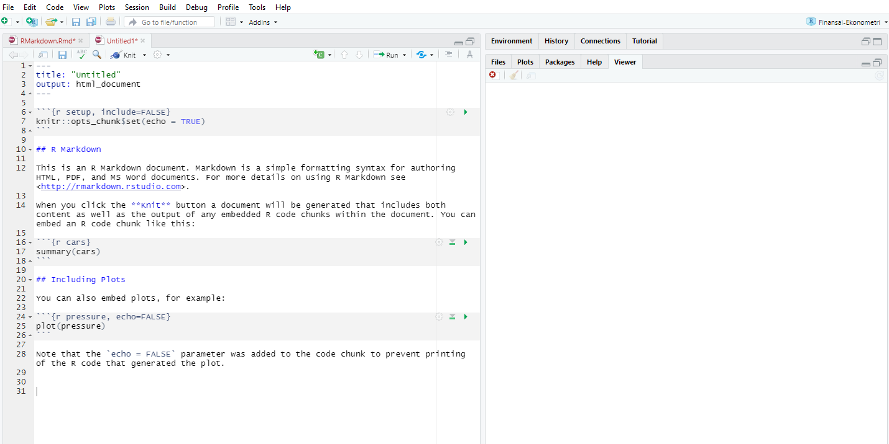
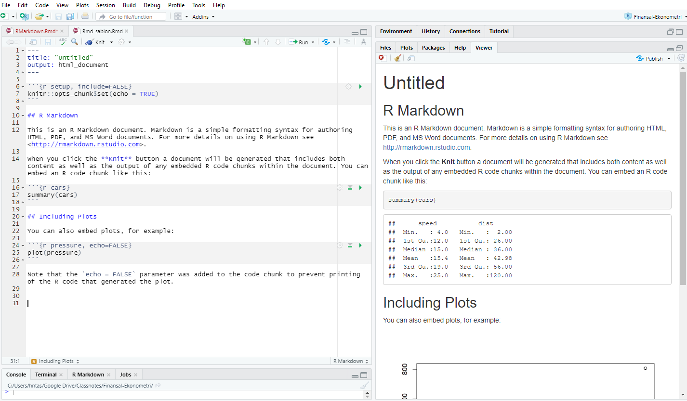
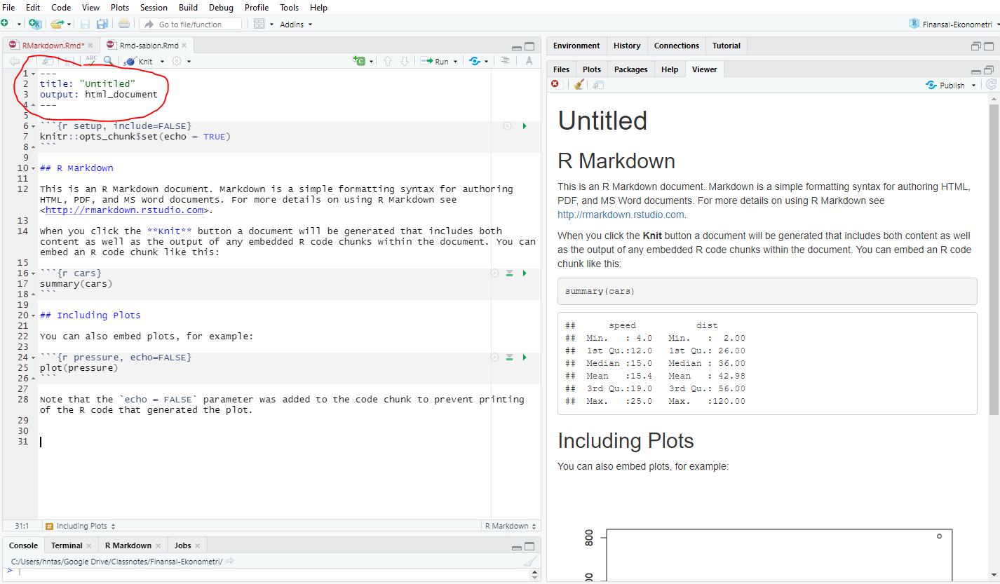
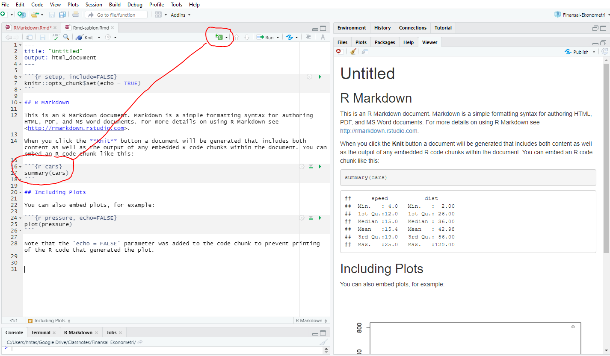
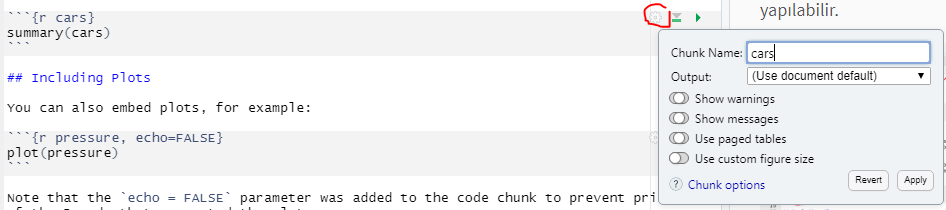
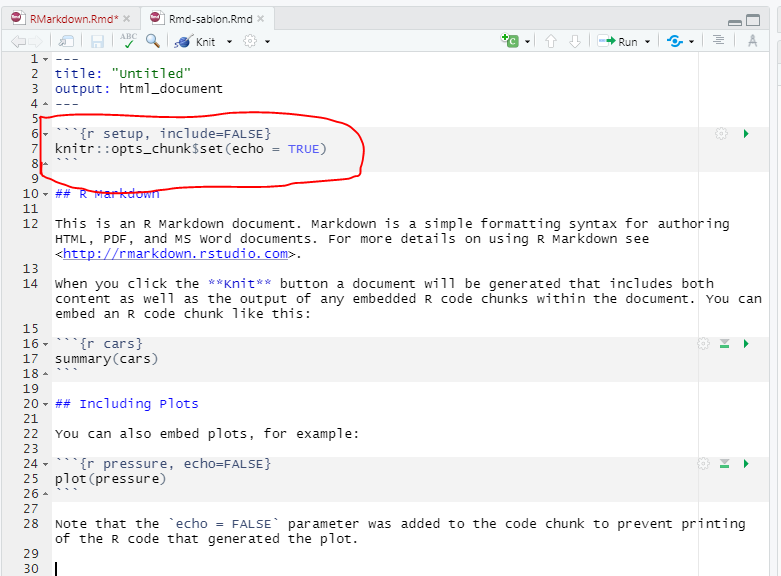
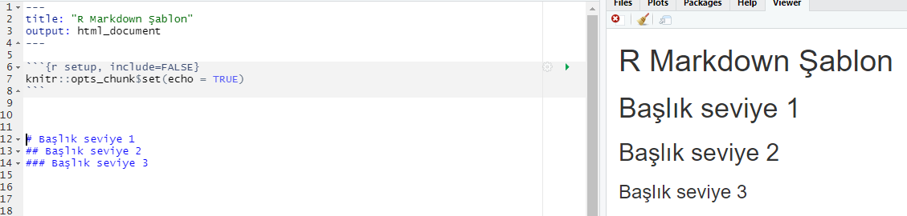

<style type="text/css"> 
body{
  background-color: #FAFAFA;
  font-size: 18px;
  line-height: 1.8;
}
code.r{
  font-size: 12pt;
}
</style>

```{r setup, include=FALSE}
# knitr::opts_chunk$set(echo = TRUE, results = 'asis', fig.show = 'asis')
knitr::opts_chunk$set(echo = TRUE, message=FALSE, warning=FALSE)
Sys.setlocale("LC_ALL", "turkish")
``` 

<br/>
<br/>


## R Markdown Nedir? 

R Markdown veri analizinde kullanılan programlar ile buradan elde edilen sonuçların tartışıldığı metni birleştiren bir platform sunar. RStudio tarafından geliştirilmiştir, bkz. [https://rmarkdown.rstudio.com/index.html](https://rmarkdown.rstudio.com/index.html). Ayrıca hızlı bir başlangıç için bkz. [https://rmarkdown.rstudio.com/lesson-1.html](https://rmarkdown.rstudio.com/lesson-1.html). 

`Rmd` uzantılı R markdown dosyaları özünde bir text dosyasıdır. `knitr` paketiyle bu dosyada yer alan komutlar bir markdown (md) dosyasına dönüştürülür. Daha sonra `pandoc` yardımıyla istenen dosya formatlarına dönüştürülür. Dosya formatları `html`, `pdf` veya `docx` olabilir. 

 

Bir R markdown dosyası oluşturmak için RStudio menüsünde yer alan basit şablon kullanılabilir. Bunun için sol üst köşede yer alan menüden `New file -> R Markdown` seçilir. Dosya ismi ve çıktı türü seçildikten sonra R markdown dosyayı oluşturulur: 



R markdown dosyası `{knitr}` ile işlendikten sonra çıktı ayrı bir pencerede ya da RStudio'da sağ altta yer alan `Viewer` penceresinde görülebilir. 



## Başlık ve diğer seçenekler 

R Markdown dosyasında en üstte `---` ile başlayıp biten kısımda raporun başlığı ve çıktı türü ve diğer seçenekler yer alır. 



## Programların eklenmesi

R programı eklemek için ` ```{r}` ile başlayıp ` ``` ` ile biten sınırlandırıcılar kullanılabilir. Ya da RStudio menüsünden aynı işlem yapılabilir. 



## Program opsiyonları 

Programların nasıl çalıştırılacağı, sonuçların son dokümanda gösterilip gösterilmeyeceği, hata veya uyarı mesajlarının yazılıp yazılmayacağı gibi çeşitli opsiyonları belirlemek için:  




Bu tercihler sadece ilgili program parçası için geçerlidir (lokaldir). Opsiyonları global olarak belirlemek için: 




## Metin

R kod parçaları dışındaki kısım metin olarak algılanır. Buraya dilediğimiz gibi tasarlayabiliriz. Tipik olarak veri analizinin sonuçları tartışılabilir. 

Bölüm, alt-bölüm başlıklarını belirlemek için `#` kullanılabilir. 
 


## Grafikler 

Grafikler R programlarıyla çizilebilir (bkz.`Rmd-sablon.Rmd`). 
Eğer elimizdeki bir resim dosyasını eklemek istersek `` komutu kullanılabilir. Bu dosyanın aynı klasörde yer alması gerekir. 

## Tablolar 

Tablo eklemek için bkz. [https://rmarkdown.rstudio.com/lesson-7.html](https://rmarkdown.rstudio.com/lesson-7.html)

## R Markdown Cheatsheets 

[https://rmarkdown.rstudio.com/lesson-15.html](https://rmarkdown.rstudio.com/lesson-15.html)


<br>
<div class="tocify-extend-page" data-unique="tocify-extend-page" style="height: 0;"></div>


