

# Plan

 
- [Yapay Sinir Ağları](#ysa) 

- [Kısa tarihçe](#history)

- [ANN'lerin yapısı](#struct)

- [Basit bir örnek](#ex1)

- [Çok katmanlı ağlar](#multi)

- [Sinir ağlarının eğitilmesi](#training)

- [Convolutional Neural Networks](#cnn)

- [Recurrent Neural Networks](#rnn)

---
name: ysa 

# Yapay Sinir Ağları (YSA) 

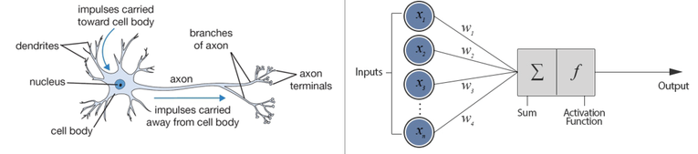  
 

- Yapay sinir ağları beyindeki sinir hücrelerinin (nöronların) çalışma prensiplerinden hareketle oluşturulan doğrusal olmayan ve oldukça esnek modellerdir.

- Biyolojik sinir ağları elektrik sinyallerini kullanarak bilgiyi iletebilen ve çıktı üreten nöronlardan oluşur.   

---
# Yapay Sinir Ağları (YSA) 

  
 
- Benzer şekilde, bir YSA modeli, çok sayıda girdiyi bilinmeyen bir parametre vektörü ile ağırlıklandırarak çıktıya dönüştürür.

-  Çıktı değişkeni birden fazla olabilir. 

- Hem regresyon hem de sınıflandırma problemlerine uygulanabilir.   

---
name: history

# Derin Öğrenmenin Tarihi

- 1940 - 1950 
  - Yapay sinir ağları ilk kez beyindeki biyolojik sinir ağlarından esinlenerek tanıtıldı.

- 1960 - 1970 
  - Özellikle Frank Rosenblatt tarafından perceptronların geliştirilmesiyle yapay sinir ağları alanında önemli ilerlemeler kaydedildi.
  - Ancak, perceptronların doğrusal olmayan problemleri çözmedeki sınırlılıkları, yapay sinir ağlarına olan ilginin azalmasına neden oldu.

---
# Kısa tarihçe

- 1980 - 1990 
  - Geriye yayılım (backpropagation) algoritması yeniden keşfedildi ve popüler hale getirildi. Çok katmanlı perceptronların verimli bir şekilde eğitilmesi olanaklı hale geldi. 
  - Bu ilerlemelere rağmen, yapay sinir ağları karmaşık görevleri işlemede zorluklarla karşılaştı ve diğer makine öğrenimi yaklaşımlarının gölgesinde kaldı.

- 2000 - 2010 
  - Yapay sinir ağlarına olan ilginin yeniden canlanması, derin öğrenmedeki çığır açan gelişmelerle başladı. Yann LeCun ve diğerleri tarafından görüntü tanıma problemlerinde başarılı sonuçlar veren Evrişimli (Convolutional) Sinir Ağları (CNN'ler) tanıtıldı.
  - Ardışık veri işleme için Tekrarlayan (Recurrent) Sinir Ağları (RNN'ler), konuşma tanıma ve doğal dil işleme alanlarında ilerlemelere yol açtı.
  
---
# Derin Öğrenmenin Tarihi

  
- 2012 -  günümüz
  - 2012'de ImageNet Büyük Ölçekli Görsel Tanıma Yarışması (ILSVRC), AlexNet'in zaferiyle önemli bir aşama kaydetti. Bkz.  <https://en.wikipedia.org/wiki/ImageNet#ImageNet_Challenge>
 
- O zamandan beri, derin öğrenme, nesne tespiti, makine çevirisi ve otonom sürüş gibi görevlerde dikkate değer başarılar elde ederek çeşitli alanlarda baskın bir yaklaşım haline gelmiştir.
  
- Donanım (örneğin GPU'lar) ve yazılım (TensorFlow ve PyTorch gibi derin öğrenme çerçeveleri) alanındaki gelişmeler, derin öğrenmenin ilerlemesini daha da hızlandırmıştır.
 
---
name: struct

# YSA'nın yapısı

.pull-left[
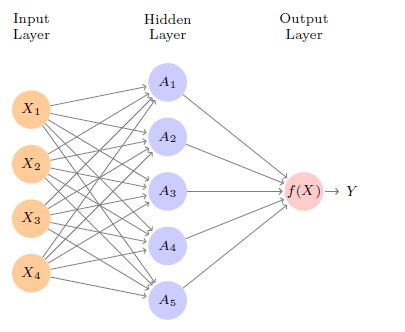 
- Yapay sinir ağlarının yapısı bir şebeke grafiği ile stilize bir şekilde gösterilebilir. (image source: James et al. ISLR, 2nd ed., p.405) 

]
--
.pull-right[
- Tipik bir YSA üç ana katmandan oluşur: girdi katmanı (input), gizli katmanlar (hidden layers), ve çıktı katmanı (output)

- Giriş katmanı, girdi (kestirim) verilerini alır ve çıkış katmanına ulaşmadan önce gizli katmanlar aracılığıyla işlenir.

- Bu ağ mimarisi, YSA'nın regresyon ve sınıflandırma dahil olmak üzere çeşitli görevlerde etkili bir şekilde öğrenmesine ve tahmin yapmasına olanak tanır.

]

---
# YSA (ANN) 

- ANN çok katmanlı veya tek katmanlı olabilir.
- Bir ANN'nin bileşenleri: 
  - Girdiler: $x_1, x_2,\ldots,x_p$ 
  - Ağırlıklar (bilinmeyen parametreler): $w_1,w_2,\ldots,w_p$, ve $w_0$ (sabit ya da sapma/bias) 
  - Toplama fonksiyonu: $\sum_{j=1}^{d} w_{j} x_{j}+w_{0}$ 
  - Aktivasyon fonksiyonu: $h(\cdot)$ 
- Basit bir ANN (perceptron/algılayıcı) şu şekilde yazılabilir: 
$$y=h\left( \sum_{j=1}^{d} w_{j} x_{j}+w_{0} \right)$$

---
# Aktivasyon Fonksiyonları

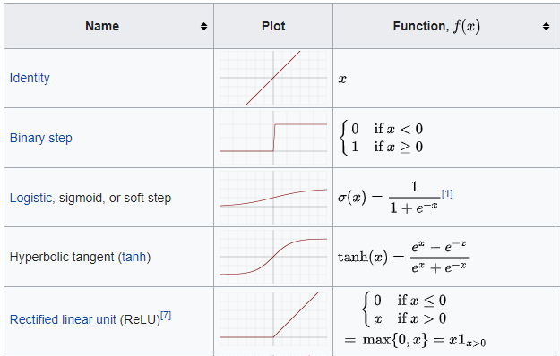 
- Aktivasyon fonksiyonları 
([Source](https://en.wikipedia.org/wiki/Activation_function))

- Yaygın kullanılanlar: Sigmoid ve Rectified Linear (ReLu) 

---
# Sigmoid Aktivasyon fonksiyonu

.pull-left[ 
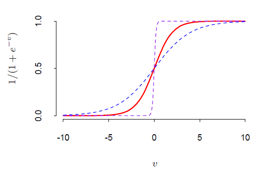 
- Sigmoid aktivasyon fonksiyonu (kırmızı): 
$$\sigma(v) = \frac{1}{1+e^{-v}}$$

]
--
.pull-right[
- Grafikte ayrıca $\sigma(sv)$ iki değer için gösterilmiştir: $s=0.5$ (mavi), 
$s=10$ (mor) (Kaynak: Elements of Statistical Learning, p.394)
- Aktivasyon fonksiyonu $\sigma=1$ olduğunda (identity function) model girdilere göre doğrusal olur. 
- Bir YSA aslında doğrusal sınıflandırma ya da regresyon problemlerinin 
doğrusal olmayan genelleştirmesi olarak düşünülebilir. 
]

---
# ReLU aktivasyon fonksiyonu

.pull-left[ 
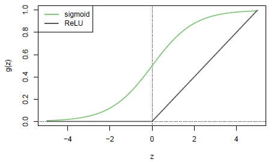 
- Rectified Linear Unit (ReLU) aktivasyon fonksiyonu: 
$$g(z)=(z)_{+}= \begin{cases}0 & \text { if } z<0\\z & \text { otherwise }\end{cases}$$

]
--
.pull-right[
- $z$'nin negatif değerleri için aktivasyon fonksiyonu 0 olur. 
- Diğer değerler için $z$ olur. 
- ReLU fonksiyonu sigmoid fonksiyonundan daha verimli bir şekilde saklanabilir
- Detaylar için bkz. ISLR2, p. 405. 
]

---
name: ex1 

# Örnek: Basit bir ileri beslemeli YSA  

$$\hat{y} = -3.01408(-2.46247 - 0.76578x_1+1.49965x_2-1.29388x_3) + 2.17061$$
$$\hat{y}\approx 9.593+2.308x_1-4.52x_2+3.90x_3$$
.pull-left[ 
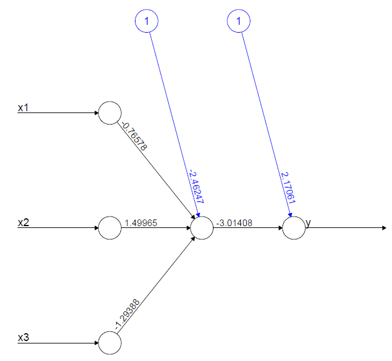 
]
--
.pull-right[ 
- 3 girdi, tek katman, aktivasyon fonksiyonu: $h(z)=z$ (identity)
- Aslında bu OLS regresyonu ile aynıdır: 
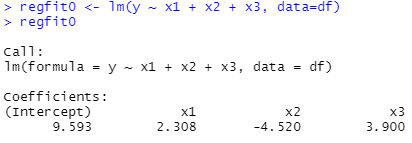 
- Bir yapay sinir ağacı $x$ değişkenleri arasındaki etkileşimi açık olarak belirtmeden yakalayabilir.
]

---
# Örnek
 
.pull-left[ 
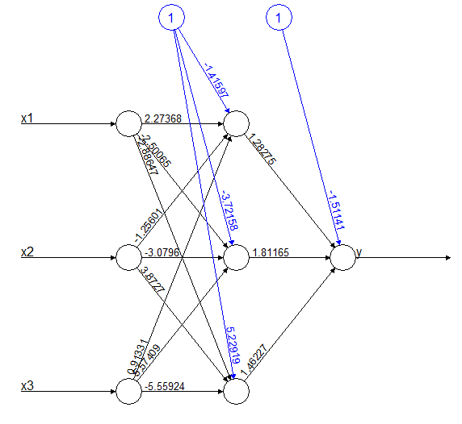 
]
--
.pull-right[ 
- Tek gizli katmanlı, üç hücreli bir ileri beslemeli yapay sinir ağı (mavi renkte
gösterilenler sabitlerdir; YSA jargonunda "bias")
- Bu model değişken etkileşimlerine izin verir. 
]

---
# MNIST handwritten-digit problem 

.pull-left[ 
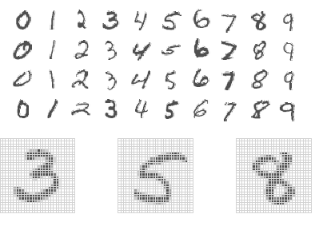 
- Bu problem, el yazısı rakamları doğru bir şekilde tanımlamak için bir sınıflandırma problemidir, $0,1,\ldots,9$
(kaynak: James et al. ISLR, 2nd ed., p.407) 
]
--
.pull-right[ 
- El yazısı rakamlar, $28\times 28$ gri tonlamalı görüntüler olarak kaydedilir.

- Eğitim setinde 60000 görüntü, test setinde ise 10000 görüntü bulunmaktadır. 

- Özellikler: 784 piksel gri tonlama değerleri

- Etiketler: rakamlar $0,1,\ldots,9$

- İnsan hata oranı: %0.2 (10000'de 20)

- Makine hata oranları: en iyi oranlar %0.5'in altındadır.
]

---
name: multi

# Çok katmanlı ağlar

.pull-left[
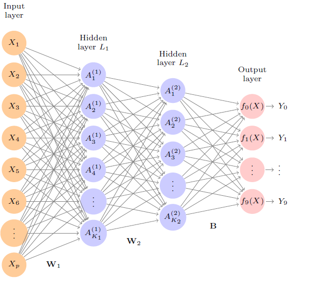 
- Burada $L_1$ and $L_2$ ile gösterilen 2 gizli katman ve çoklu çıktılar bulunmaktadır. (kaynak: James et al. ISLR, 2nd ed., p.409) 

]
--
.pull-right[
- Bu örnek, el yazısı rakam tanıma (MNIST problemi) için uygundur.

- Girdi katmanında 784 birim bulunurken, iki gizli katmanda sırasıyla $K_1=256$ ve $K_2=128$ birim (hücre) bulunmaktadır. Çıktı katmanında ise 10 birim (rakamlar $0,1,\ldots,9$) bulunmaktadır. 

- Bu YSA'da sabitler (sapma) dahil olmak üzere 235146 parametre (ağırlık) vardır.  

]

---
name: training

# Yapay Sinir Ağlarının Eğitilmesi

- YSA modellerinde amaç fonksiyonu regresyon problemleri için kalıntı kareleri toplamı: 

$$R(\theta)=\sum_{k=1}^{K} \sum_{i=1}^{N}\left(y_{i k}-f_{k}\left(x_{i}\right)\right)^{2}$$

- Sınıflandırma problemleri için ise hata karesi ya da çapraz-entropi (deviance):  
$$R(\theta)=-\sum_{i=1}^{N} \sum_{k=1}^{K} y_{i k} \log f_{k}\left(x_{i}\right)$$

$\theta$: bilinmeyen ağırlık vektörü, $y_{i k}$: gözlem değerleri, $f_{k}$: $k$ çıktısı için tahmin değeri, $K$ çıktı sayısını, $N$ gözlem sayısı 

---
# Yapay Sinir Ağlarının Eğitilmesi

- Minimum $R(\theta)$ değerini veren ağırlıklar gradyan iniş algoritması ile bulunabilir (gradient descent). 

- Bu algoritma geri-yayılım algoritması olarak da bilinir (back-propagation algorithm). 

- Gradyan (birinci türev vektörü)  zincir kuralı ile kolayca hesaplanabilir. 

- Fazla uyumdan kaçınmak için genellikle gradyan vektörü küçük pozitif bir parametre ile çarpılır. Böylece öğrenme hızı kontrol edilebilir. 

- Algoritmanın detayları için bkz. ss. 395-397, Hastie, Tibshirani, Friedman (2017), Elements of Statistical Learning, 2nd ed. Springer 

---
# Gradyan iniş algoritması

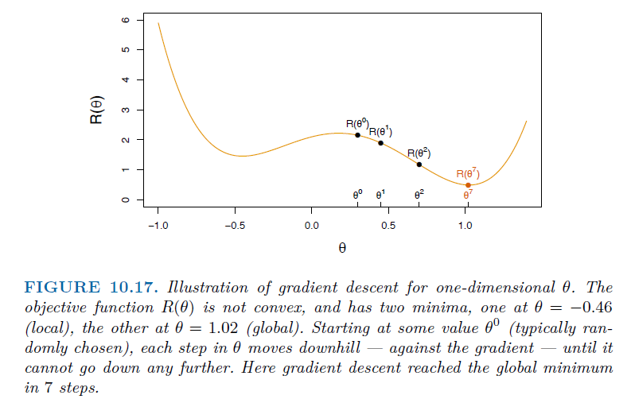 

(kaynak: James et al. ISLR, 2nd ed., p.435) 
---
name: cnn

# Evrişimli (Convolutional) Yapay Sinir Ağları (CNNs)
.pull-left[
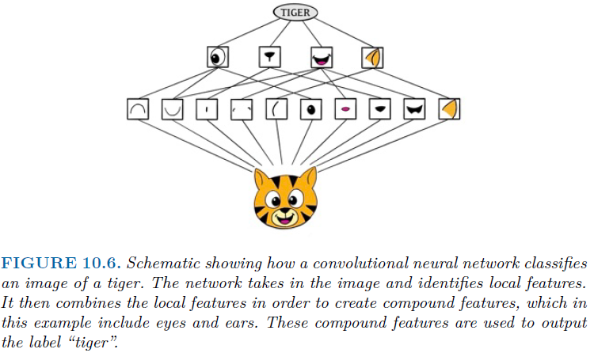 

(kaynak: James et al. ISLR, 2nd ed., p.412) 
]
--
.pull-right[
- CNN'ler, özellikle görüntülerin sınıflandırılması için oldukça yararlı olabilir.
- Bu örnekte bir kaplan resminin köşe, renk parçaları gibi daha yerel, düşük düzeydeki özellikleri belirlenir. Daha sonra bu yerel özellikler birleştirilerek daha yüksek düzeydeki özellikler belirlenir (göz, kulak, vb). Bu birleştirilmiş özellikler resmin sınıflandırılmasında kullanılır. 
- CNN, bir görüntüyü hiyerarşik bir şekilde oluşturur. 
]

---
# Evrişimli (Convolutional) Yapay Sinir Ağları (CNNs)
.pull-left[
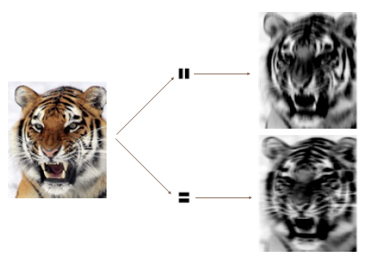 

(kaynak: James et al. ISLR, 2nd ed., p.414) 
]
--
.pull-right[
- Bu hiyerarşik yapının oluşturulması, evrişim (convolution) ve havuzlama (pooling) katmanları kullanılarak gerçekleştirilir. 
- Convolution katmanı çok sayıda filtreden oluşur. Bu filtreler yerel özelliklerin belirlenmesinde kullanılır. 
- Pooling (havuzlama) katmanı ise çok sayıda görüntüyü özet bir görüntüye dönüştürür. ]
---
# CNNs 

.pull-left[
 

(kaynak: James et al. ISLR, 2nd ed., p.414) 
]
--
.pull-right[
- Filtrenin kendisi de bir görüntüdür ve küçük bir şekil, kenar vb. temsil eder. Bu filtreyi girdi görüntüsü etrafında kaydırır ve eşleşmeler için puan verilir. 
- Girdi görüntüsünün alt görüntüsü, filtreye benziyorsa, puan yüksek olur, aksi takdirde düşüktür.
- Örnekteki kaplan resminde iki küçük evrişim filtresi uygulanmıştır. Üstteki evrişimli görüntü kaplanın dikey çizgilerini, alttaki ise yatay çizgilerini vurgular.

- Filtreler eğitim sırasında öğrenilir.  
]
---
name: rnn

# Tekrarlayan (Recurrent) Sinir Ağları (RNNs)

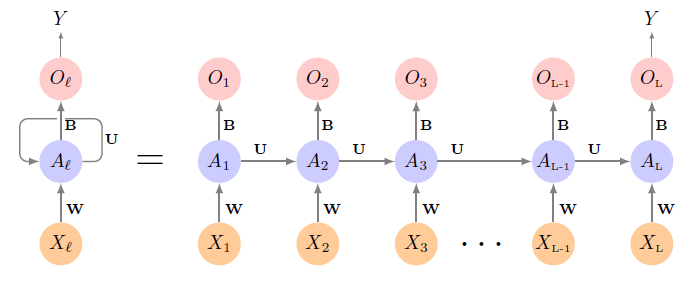 

- RNN'ler, zaman serileri, kaydedilmiş konuşma, müzik veya belgedeki kelimelerin bir dizisi gibi sıralı veriler için özellikle yararlıdır.

- RNN'ler, verinin bu ardışık doğasını dikkate alarak modeller oluşturur ve geçmişi belleğinde saklar.

(kaynak: James et al. ISLR, 2nd ed., p.422) 

---
# Tekrarlayan (Recurrent) Sinir Ağları (RNNs)

- RNN'lerde özellik kümesi, vektörlerin bir dizisi olarak temsil edilir $X=\{X_1,X_2,\ldots,X_L\}$. Çıktı değişkeni $Y$  de bir vektör olabilir (örneğin aynı belgenin başka bir dildeki tercümesi). 

- Bu örnekte tek hedef değişkeni $Y$ bulunmaktadır. 

- RNN girdileri $\{X_1,X_2,\ldots,X_L\}$ ardışık olarak işler.  Her $X_l$ gizli katmana mevcut aktivasyon vektörü $A_l$ ile beslenir. 

- $A_l$, girdi olarak hem $X_l$ hem de $A_{l-1}$'i alır ve bir çıktı $O_l$ üretir. 

- $W$, $U$, ve $B$ ağırlıklardır 

- Tekrarlayan (recurrent) = aynı ağırlıkların sıralı adımlarda kullanılması.

- Matematiksel detaylar için ders kitabının 423-4. sayfalarına bakabilirsiniz.

---
# LSTM 

- Long Term and Short Term Memory (LSTM) ya da Uzun Vadeli ve Kısa Vadeli Bellek, RNN'lerin bir varyasyonudur.  

- Ekonomik ve finansal zaman serileri verilerinde, mevcut değer hem mevcut şoklara hem de geçmiş şoklara bağlı olabilir.

- LSTM RNN'ler, hem mevcut değerlerden (kısa vadeli) hem de uzak geçmişten gelen değerlerden aktivasyonları korur. Bu nedenle, LSTM RNN'ler, erken sinyallerin zamanla silinmesi sorununu aşar, çünkü bu sinyaller zincir boyunca son aktivasyon vektörüne iletilene kadar korunur (ISLR2, s. 426).

- Bu özellik, finans ve ekonomide tahmin yaparken özellikle yararlı olabilir çünkü zaman serisi verileri genellikle yüksek oranda sürekli (otokorelasyonlu) olabilir.

(NYSE örneği için 427. sayfaya bakınız)

<!-- --- -->

<!-- 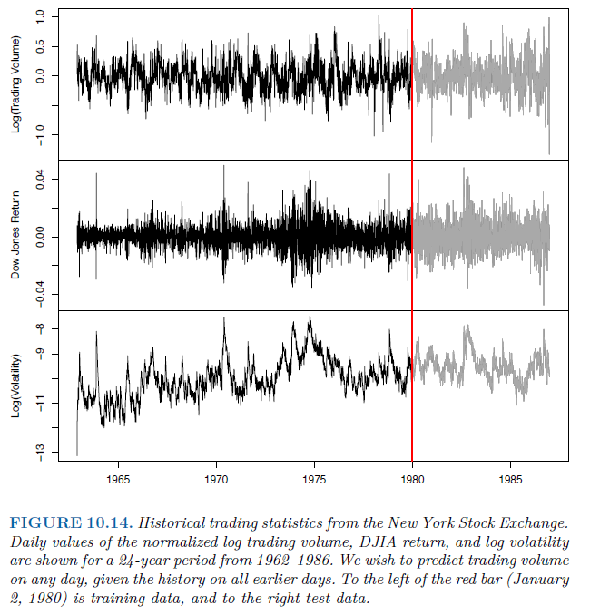  -->

<!-- (image source: James et al. ISLR, 2nd ed., p.427)  -->
